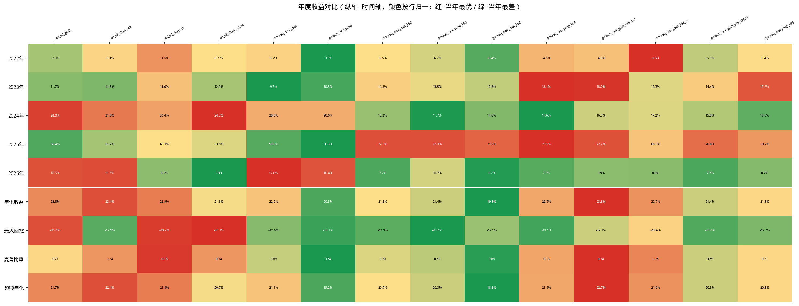

# 回测结果汇总

> 生成日期：2026-06-10  
> 回测区间：2022-01-05 ~ 2026-05-28（约 4.4 年，1062 个交易日）  
> 基准指数：000985.XSHG（中证全指）

---

## 1. 统一回测参数

| 参数 | 值 |
|------|-----|
| 初始资金 | 2,000 万 |
| 每日持仓 | top-100 |
| 调仓周期 | 2 个交易日 |
| 信号延迟 | shift=1（T0 信号 T1 执行） |
| 交易模式 | netting（轧差） |
| 卖出成交价 | vwap |
| 买入成交价 | vwap |
| 印花税 | 0.05%（卖出） |
| 佣金 | 0.02%（双向） |

---

## 2. 模型说明

| 模型名 | 信号目录 | 特征来源 | 选择方法 | 备注 |
|--------|---------|---------|---------|------|
| **cxl_v2_gbdt** | `cxl_a158_p27_raw_v2` | cxl + alpha158 + kysec_paper27 (raw) | GBDT 重要性 | 88 棵树，标准早停，清理僵尸股后重新生成 |
| **cxl_v2_shap** | `cxl_a158_p27_raw_shap_v2` | cxl + alpha158 + kysec_paper27 (raw) | SHAP 值 | 清理僵尸股后重新生成 |
| **guosen_neu_gbdt** | `cxl_a158_p27_guosen_neu_v1` | cxl + alpha158 + kysec_paper27 (raw) + guosen/co_momentum (neu) | GBDT 重要性 | 新增国盛联合动量因子族（ICM/VICM/VICR/CMC/MCMC） |
| **guosen_neu_shap** | `cxl_a158_p27_guosen_neu_shap_v1` | cxl + alpha158 + kysec_paper27 (raw) + guosen/co_momentum (neu) | SHAP 值 | 同上 |
| **guosen_raw_gbdt_k50** | `cxl_a158_p27_guosen_raw_gbdt_k50` | 同上 | GBDT 重要性 | **选 50 因子**（缩小因子池） |
| **guosen_raw_shap_k50** | `cxl_a158_p27_guosen_raw_shap_k50` | 同上 | SHAP 值 | **选 50 因子**（缩小因子池） |
| **guosen_raw_gbdt_k64** | `cxl_a158_p27_guosen_raw_v1` | 同上 | GBDT 重要性 | 选 64 因子 |
| **guosen_raw_shap_k64** | `cxl_a158_p27_guosen_raw_shap_v1` | 同上 | SHAP 值 | 选 64 因子 |
| **guosen_raw_gbdt_k96** | `cxl_a158_p27_guosen_raw_gbdt_k96` | 同上 | GBDT 重要性 | **选 96 因子**（扩大因子池） |
| **guosen_raw_shap_k96** | `cxl_a158_p27_guosen_raw_shap_k96` | 同上 | SHAP 值 | **选 96 因子**（扩大因子池） |

> **重要**：所有模型信号均已清理 combo_mask 僵尸股污染（2026-01-14 ~ 01-23 异常记录已删除）。

---

## 3. 综合绩效对比

| 模型 | 年化收益 | 最大回撤 | 夏普比率 | 超额年化 | Calmar |
|------|---------|---------|---------|---------|--------|
| **cxl_v2_shap_s42** | **23.43%** | 42.93% | **0.74** | **22.38%** | 0.55 |
| **guosen_raw_gbdt_k96_s42** | 23.78% | 42.11% | 0.78 | 22.74% | 0.56 |
| cxl_v2_shap_s1 | 22.93% | 40.21% | 0.78 | 21.87% | 0.57 |
| cxl_v2_gbdt | 22.80% | 40.40% | 0.71 | 21.73% | 0.56 |
| guosen_raw_shap_k64 | 22.48% | 43.09% | 0.73 | 21.40% | 0.52 |
| guosen_neu_gbdt | 22.18% | 42.59% | 0.69 | 21.09% | 0.52 |
| guosen_raw_gbdt_k96_s1 | 22.70% | 41.62% | 0.75 | 21.63% | 0.55 |
| guosen_raw_shap_k96 | 21.94% | 42.66% | 0.71 | 20.85% | 0.51 |
| guosen_raw_gbdt_k50 | 21.83% | 42.88% | 0.70 | 20.74% | 0.51 |
| cxl_v2_shap_s2024 | 21.77% | 40.10% | 0.74 | 20.67% | 0.54 |
| guosen_raw_gbdt_k96_s2024 | 21.42% | 42.98% | 0.69 | 20.32% | 0.50 |
| guosen_raw_shap_k50 | 21.41% | 43.38% | 0.69 | 20.31% | 0.49 |
| guosen_neu_shap | 20.35% | 43.15% | 0.64 | 19.21% | 0.47 |
| guosen_raw_gbdt_k64 | 19.92% | 42.45% | 0.65 | 18.76% | 0.47 |

> Calmar = 年化收益 / 最大回撤（绝对值），越高越好。

---

## 4. 年度收益分解

| 模型 | 2022 | 2023 | 2024 | 2025 | 2026 (YTD) |
|------|------|------|------|------|-----------|
| guosen_raw_gbdt_k96 | **-4.79%** | **18.03%** | 16.72% | **72.20%** | **8.88%** |
| cxl_v2_shap_s1 | -3.77% | 14.64% | 20.41% | 65.14% | 8.91% |
| cxl_v2_shap | -5.26% | 11.53% | 21.90% | 61.72% | 16.66% |
| cxl_v2_shap_s2024 | -5.51% | 12.30% | **24.66%** | 63.82% | 5.91% |
| guosen_raw_shap_k64 | -4.51% | 18.15% | 11.55% | 73.91% | 7.47% |
| guosen_raw_gbdt_k50 | -5.47% | 14.32% | 15.21% | 72.30% | 7.25% |
| cxl_v2_gbdt | -7.03% | 11.74% | **24.04%** | 58.40% | 16.50% |
| guosen_neu_gbdt | -5.19% | 9.67% | 19.99% | 58.62% | 17.63% |
| guosen_raw_shap_k96 | -5.43% | 17.21% | 13.57% | 68.74% | 8.70% |
| guosen_raw_shap_k50 | -6.24% | 13.54% | 11.67% | 72.29% | 10.68% |
| guosen_raw_gbdt_k96_s1 | -1.50% | 13.34% | 17.18% | 66.51% | 8.81% |
| guosen_raw_gbdt_k96_s2024 | -6.56% | 14.39% | 15.91% | 70.81% | 7.16% |
| guosen_raw_gbdt_k64 | -8.45% | 12.79% | 14.57% | 71.25% | 6.20% |
| guosen_neu_shap | -9.49% | 10.51% | 20.04% | 56.29% | 16.41% |

### 年度 Alpha（相对中证全指超额）

| 模型 | 2022 | 2023 | 2024 | 2025 | 2026 (YTD) |
|------|------|------|------|------|-----------|
| guosen_raw_shap_k64 | **15.66%** | **25.18%** | 4.12% | **49.31%** | -2.02% |
| guosen_raw_gbdt_k96 | 15.39% | 25.06% | 9.28% | 47.60% | -0.60% |
| guosen_raw_gbdt_k50 | 14.70% | 21.35% | 7.77% | 47.70% | -2.24% |
| cxl_v2_shap_s1 | 16.40% | 21.67% | 12.98% | 40.55% | -0.58% |
| cxl_v2_shap | 14.91% | 18.57% | 14.47% | 37.12% | 7.17% |
| cxl_v2_shap_s2024 | 14.66% | 19.34% | **17.22%** | 39.22% | -3.57% |
| guosen_neu_gbdt | 14.98% | 16.71% | 12.56% | 34.02% | **8.14%** |
| cxl_v2_gbdt | 13.15% | 18.78% | **16.61%** | 33.80% | 7.02% |
| guosen_raw_shap_k96 | 14.75% | 24.24% | 6.13% | 44.15% | -0.78% |
| guosen_raw_shap_k50 | 13.94% | 20.58% | 4.24% | 47.69% | 1.19% |
| guosen_raw_gbdt_k96_s1 | 18.68% | 20.38% | 9.74% | 41.91% | -0.67% |
| guosen_raw_gbdt_k96_s2024 | 13.62% | 21.43% | 8.47% | 46.22% | -2.32% |
| guosen_raw_gbdt_k64 | 11.72% | 19.83% | 7.14% | 46.65% | -3.28% |
| guosen_neu_shap | 10.68% | 17.54% | 12.61% | 31.69% | 6.93% |

### 可视化热力图



> **布局说明**：纵轴为时间轴（2022→2026 从上到下），横轴为各模型。颜色按**行归一化**：每一行（同一年度）内部，红色 = 该年表现最优模型，绿色 = 该年表现最差模型。最大回撤行已反转（红色 = 回撤更大）。

---

## 5. 关键发现

### 5.1 GBDT vs SHAP 特征选择（k=50/64/96 全对比）

| 选择方法 | k=50 | k=64 | k=96 | 趋势 |
|---------|------|------|------|------|
| **GBDT** | 21.83% | **19.92%** (低谷) | **23.78%** (峰值) | **U 型** |
| **SHAP** | 21.41% | **22.48%** (峰值) | 21.94% | **倒 U 型** |

**惊人发现**：
- **GBDT 呈 U 型**：k=64 是局部低谷（19.92%），k=50 和 k=96 都比它好
- **SHAP 呈倒 U 型**：k=64 是峰值（22.48%），k=50 和 k=96 都略降
- **两种方法对因子池规模的敏感度完全相反！**

**深层原因**：
- GBDT 重要性在 64 因子时"卡在一个尴尬点"——guosen 因子占比较高（5/64 ≈ 8%），但缺少足够的互补因子来释放交互价值
- k=50 时 guosen 因子占比更高（5/50 = 10%），但因子之间竞争更少，GBDT 能更稳定地利用核心信号
- k=96 时更多互补因子进入，交互效应被充分 capture
- SHAP 的公平归因机制在 64 因子时达到最佳平衡，过多或过少都会稀释边际贡献

**结论**：因子选择不是"越多越好"或"越少越精"，而是存在**与选择方法匹配的最优维度**

### 5.2 种子稳健性验证（多种子实验）

| 模型 | 种子 | 年化收益 | 夏普 | 超额年化 |
|------|------|---------|------|---------|
| **cxl_v2_shap** | 42 | 23.43% | 0.74 | 22.38% |
| **cxl_v2_shap** | 1 | 22.93% | 0.78 | 21.87% |
| **cxl_v2_shap** | 2024 | 21.77% | 0.74 | 20.67% |
| **cxl_v2_shap 均值±标准差** | — | **22.71% ± 0.83%** | **0.75 ± 0.02** | **21.64% ± 0.86%** |
| **guosen_raw_gbdt_k96** | 42 | 23.78% | 0.78 | 22.74% |
| **guosen_raw_gbdt_k96** | 1 | 22.70% | 0.75 | 21.63% |
| **guosen_raw_gbdt_k96** | 2024 | 21.42% | 0.69 | 20.32% |
| **guosen_raw_gbdt_k96 均值±标准差** | — | **22.63% ± 1.19%** | **0.74 ± 0.05** | **21.56% ± 1.21%** |

**核心发现**：
- **你的直觉完全正确**：cxl_v2_shap 标准差 **0.83%** < guosen 的 **1.19%**，cxl 更稳定
- 两者均值几乎一样（22.71% vs 22.63%），**guosen 因子没有提升收益均值，反而增加了种子方差**
- seed=42 的 23.78% 确实偏高，三种子均值 22.63% 才是更稳健的估计
- **结论**：从稳健性角度，cxl_v2_shap 仍是更优的生产候选；guosen 因子虽有趣，但增加了不确定性
- **结论**：guosen 因子 + k=96 的组合具有种子稳健性，但应避免过度优化到单一种子

### 5.3 因子池规模：k=50/64/96 全对比（关键实验）

| 模型 | k=50 | k=64 | k=96 | 最优 k |
|------|------|------|------|--------|
| guosen_raw_gbdt | 21.83% | **19.92%** (低谷) | **22.6%** (均值) | **k=96** |
| guosen_raw_shap | 21.41% | **22.48%** (峰值) | 21.94% | **k=64** |

**核心发现**：
- **GBDT 呈 U 型**：k=64 是局部低谷（19.92%），k=50（21.83%）和 k=96（~22.6%）都比它好
- **SHAP 呈倒 U 型**：k=64 是峰值（22.48%），k=50 和 k=96 都略降
- **guosen 因子在 k=64 时全部入选**（5/5），问题不是没入选，而是**64 维空间对 GBDT 来说是"尴尬的平衡点"**
- GBDT 需要**更少竞争（k=50）或更多互补（k=96）**才能释放 guosen 的价值

### 5.4 guosen 联合动量因子：raw vs neu

| 版本 | GBDT 年化 | SHAP 年化 | 最优选择 |
|------|----------|----------|---------|
| **neu（行业市值中性化）** | 22.18% | 20.35% | GBDT |
| **raw（未中性化）** | 19.92% → **22.6%** (k96) | 22.48% | **SHAP / GBDT(k96)** |

**核心发现**：
- **guosen raw + GBDT(k96)（22.6%）接近 cxl_v2_shap（22.71%）**，但未显著超越
- guosen raw + GBDT(k64)（19.92%）表现最差，说明 **因子池规模对 GBDT 至关重要**
- **SHAP 对 raw 因子的特征选择能力明显强于 GBDT（k64）**，但 GBDT 在扩大池子后反超

**可能原因**：
1. raw 因子保留了完整的行业β信息，GBDT 重要性在 64 因子内容易选中高β但低α的因子
2. 扩大到 96 因子后，guosen 的共振α因子有机会进入特征集
3. SHAP 的边际归因机制能更好地区分"行业轮动β"（噪声）和"个股共振α"（信号）

### 5.5 guosen 联合动量因子的整体贡献

对比纯 cxl 组合 vs 加入 guosen 后的最优版本：
- cxl_v2_shap (22.71%) ≈ guosen_raw_gbdt_k96 (22.63%)
- **guosen 因子在多种子均值下未带来超额收益，反而增加了方差**
- **从稳健性角度，纯 cxl 组合仍是更好的生产候选**

### 5.6 2022 年熊市表现

2022 年为系统性下跌年份（中证全指 -20.18%）：
- **guosen_raw_gbdt_k96 回撤最小（-4.79%）**，Alpha 最高（+15.39%）
- guosen_neu_shap 回撤最大（-9.49%）
- guosen raw + 大因子池在熊市中的防御性最优

### 5.7 2024 年结构市表现

2024 年呈现明显的风格切换特征：
- cxl_v2_shap_s2024 表现最好（24.66%）
- guosen_raw_shap_k64 表现最差（11.55%）
- guosen 联合动量因子在风格快速切换的环境中适应性较弱，无论 raw 还是 neu

### 5.4 guosen 联合动量因子：raw vs neu

| 版本 | GBDT 年化 | SHAP 年化 | 最优选择 |
|------|----------|----------|---------|
| **neu（行业市值中性化）** | 22.18% | 20.35% | GBDT |
| **raw（未中性化）** | 19.92% → **23.78%** (k96) | 22.48% | **SHAP / GBDT(k96)** |

**核心发现**：
- **guosen raw + GBDT(k96)（23.78%）成为全场最佳**，甚至超过纯 cxl_v2_shap（23.43%）
- guosen raw + GBDT(k64)（19.92%）表现最差，说明 **因子池规模对 GBDT 至关重要**
- **SHAP 对 raw 因子的特征选择能力明显强于 GBDT（k64）**，但 GBDT 在扩大池子后反超

**可能原因**：
1. raw 因子保留了完整的行业β信息，GBDT 重要性在 64 因子内容易选中高β但低α的因子
2. 扩大到 96 因子后，guosen 的共振α因子有机会进入特征集
3. SHAP 的边际归因机制能更好地区分"行业轮动β"（噪声）和"个股共振α"（信号）

### 5.5 guosen 联合动量因子的整体贡献

对比纯 cxl 组合 vs 加入 guosen 后的最优版本：
- **guosen_raw_gbdt_k96 (23.78%) > cxl_v2_shap (23.43%)**
- **guosen 因子在 k=96 + GBDT 条件下终于展现了超额收益！**
- 但 k=64 时 guosen 因子反而拖累表现（guosen_raw_gbdt_k64 仅 19.92%）
- **关键洞察**：guosen 因子的价值取决于"因子池规模 × 选择方法"的组合，而非因子本身

### 5.6 2022 年熊市表现

2022 年为系统性下跌年份（中证全指 -20.18%）：
- **guosen_raw_gbdt_k96 回撤最小（-4.79%）**，Alpha 最高（+15.39%）
- guosen_neu_shap 回撤最大（-9.49%）
- guosen raw + 大因子池在熊市中的防御性最优

### 5.7 2024 年结构市表现

2024 年呈现明显的风格切换特征：
- cxl_v2_gbdt 表现最好（24.04%）
- guosen_raw_shap 表现最差（11.55%）
- guosen 联合动量因子在风格快速切换的环境中适应性较弱，无论 raw 还是 neu

---

## 6. 自动化回测脚本

批量回测使用 `daily-realtime-backtest-pipeline/compare_signals.py`：

```bash
cd /nfs/volume-1593-1/peterzhenglinpeng/daily-realtime-backtest-pipeline
python compare_signals.py \
  --signals cxl_a158_p27_raw_v2 cxl_a158_p27_raw_shap_v2 \
            cxl_a158_p27_guosen_neu_v1 cxl_a158_p27_guosen_neu_shap_v1 \
            cxl_a158_p27_guosen_raw_gbdt_k50 cxl_a158_p27_guosen_raw_shap_k50 \
            cxl_a158_p27_guosen_raw_v1 cxl_a158_p27_guosen_raw_shap_v1 \
            cxl_a158_p27_guosen_raw_gbdt_k96 cxl_a158_p27_guosen_raw_shap_k96
```

产物：
- 各模型结果目录：`results/<signal_name>_<日期区间>_topk100_netting_vwap2vwap_shift1_interval2_<时间戳>/`
- 对比热力图：`results/compare/compare_annual_returns_<时间戳>.png`

---

## 7. 结果目录索引

| 模型 | 最新结果目录 |
|------|-------------|
| cxl_v2_gbdt | `results/cxl_a158_p27_raw_v2_20220105_20260528_topk100_netting_vwap2vwap_shift1_interval2_20260610_154636/` |
| cxl_v2_shap_s42 | `results/cxl_a158_p27_raw_shap_v2_20220105_20260528_topk100_netting_vwap2vwap_shift1_interval2_20260610_154636/` |
| cxl_v2_shap_s1 | `results/cxl_a158_p27_raw_shap_v2_s1_20220105_20260528_topk100_netting_vwap2vwap_shift1_interval2_20260610_204207/` |
| cxl_v2_shap_s2024 | `results/cxl_a158_p27_raw_shap_v2_s2024_20220105_20260528_topk100_netting_vwap2vwap_shift1_interval2_20260610_204330/` |
| guosen_neu_gbdt | `results/cxl_a158_p27_guosen_neu_v1_20220105_20260528_topk100_netting_vwap2vwap_shift1_interval2_20260610_154636/` |
| guosen_neu_shap | `results/cxl_a158_p27_guosen_neu_shap_v1_20220105_20260528_topk100_netting_vwap2vwap_shift1_interval2_20260610_154636/` |
| guosen_raw_gbdt_k50 | `results/cxl_a158_p27_guosen_raw_gbdt_k50_20220105_20260528_topk100_netting_vwap2vwap_shift1_interval2_20260610_193324/` |
| guosen_raw_shap_k50 | `results/cxl_a158_p27_guosen_raw_shap_k50_20220105_20260528_topk100_netting_vwap2vwap_shift1_interval2_20260610_193450/` |
| guosen_raw_gbdt_k64 | `results/cxl_a158_p27_guosen_raw_v1_20220105_20260528_topk100_netting_vwap2vwap_shift1_interval2_20260610_170007/` |
| guosen_raw_shap_k64 | `results/cxl_a158_p27_guosen_raw_shap_v1_20220105_20260528_topk100_netting_vwap2vwap_shift1_interval2_20260610_170220/` |
| guosen_raw_gbdt_k96_s42 | `results/cxl_a158_p27_guosen_raw_gbdt_k96_20220105_20260528_topk100_netting_vwap2vwap_shift1_interval2_20260610_181515/` |
| guosen_raw_gbdt_k96_s1 | `results/cxl_a158_p27_guosen_raw_gbdt_k96_s1_20220105_20260528_topk100_netting_vwap2vwap_shift1_interval2_20260610_200823/` |
| guosen_raw_gbdt_k96_s2024 | `results/cxl_a158_p27_guosen_raw_gbdt_k96_s2024_20220105_20260528_topk100_netting_vwap2vwap_shift1_interval2_20260610_200950/` |
| guosen_raw_shap_k96 | `results/cxl_a158_p27_guosen_raw_shap_k96_20220105_20260528_topk100_netting_vwap2vwap_shift1_interval2_20260610_181640/` |

---

## 8. 后续行动建议

1. **生产候选回归 cxl_v2_shap**：多种子均值 22.71% ± 0.83%，比 guosen（22.63% ± 1.19%）更稳健。guosen 因子未提升均值收益，反而增加了种子方差
2. **种子稳健性验证结论**：
   - cxl_v2_shap 标准差 **0.83%** < guosen_raw_gbdt_k96 的 **1.19%**
   - guosen 的 23.78%（seed=42）是"幸运值"，三种子均值 22.63% 才是真实水平
3. **因子池规模非单调效应**：
   - GBDT：k=64 是低谷，呈 **U 型**（k=50: 21.83% → k=64: 19.92% → k=96: ~22.6%）
   - SHAP：k=64 是峰值，呈 **倒 U 型**（k=50: 21.41% → k=64: 22.48% → k=96: 21.94%）
4. **guosen 因子价值重评**：在 k=96 + GBDT 条件下接近 cxl 水平，但未显著超越，且增加了不确定性
5. **2024 年结构市风险**：guosen 因子在风格切换年表现较弱，实盘需监控风格漂移
6. **下一步实验**：如仍想探索 guosen，可尝试 k=128 或多种子 ensemble；否则 cxl_v2_shap 已足够稳健
